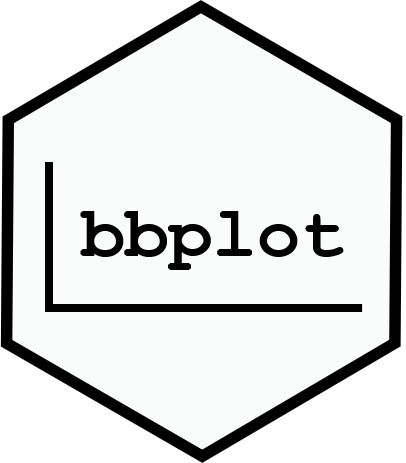

# bbplot 0.0.1

[](https://raw.githubusercontent.com/dapperstats/bbplot/master/LICENSE)
[](https://www.tidyverse.org/lifecycle/#maturing)


`bbplot` extends base R plotting for bbs.

It is a set of functions written to provide additional flexibility and power
to R graphics written using the base R plotting functionality provided by
the graphics and grDevices packages loaded by default with R.

The code is designed to specifically mimic the base plotting functions in 
API (e.g., have the same variable inputs named the same and in the same order)
as well as in function-level syntax. 

We follow the *painters model* of R graphics, where output production occurs in 
steps that are placed with subsequent steps being layered on top of earlier 
steps. We seek to extend the classical painter model to allow for removal 
of earlier steps, although this is not yet implemented. 

A formal written definition of the code and design asthetics is forthcoming.

## Status: Experimental, Active Development

The `bbplot` package is currently being actively developed, and is an early 
stage of package construction from disparate function code.

## Installation

You can install the R package from github:

```r
install.packages("devtools")
devtools::install_github("dapperstats/bbplot")
```

## Author Contributions

**J. L. Simonis** is presently the sole author of `bbplot`. 

If you are interested in contibuting, see the Contributor Guidelines. (Forthcoming)